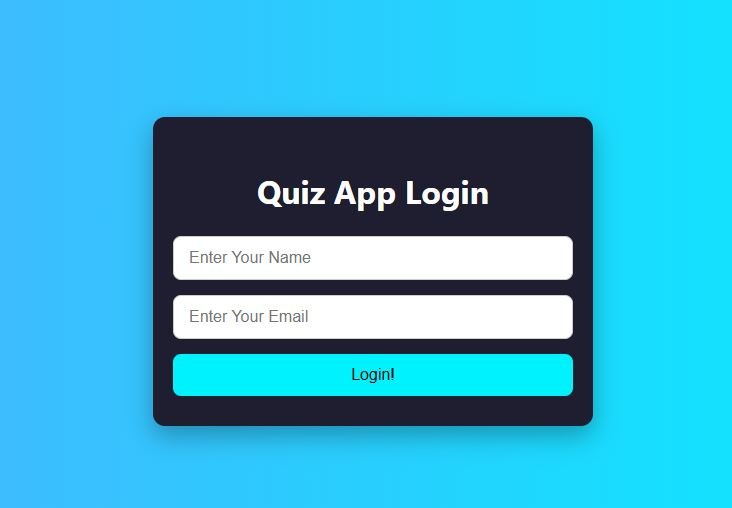
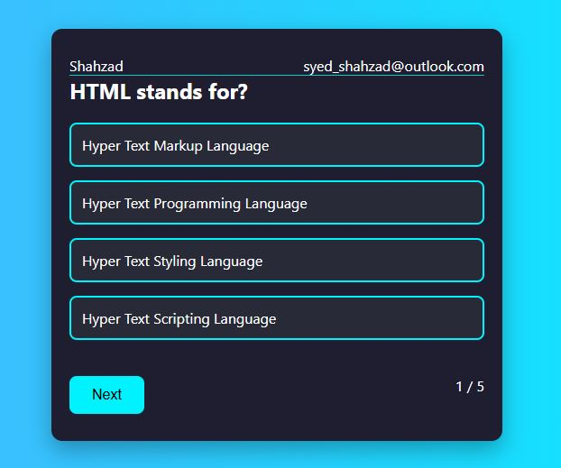
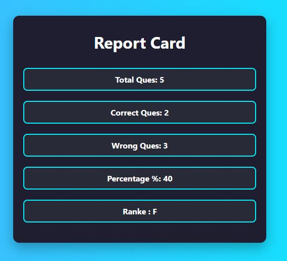

# 🎯 Quiz App

An interactive quiz application built using **HTML**, **CSS**, and **JavaScript**.

## 🚀 Features

- 🔐 **User Login**
  - User enters name and email, which are stored in `localStorage`.
  - Redirects to the quiz page with personalized data.

- ❓ **Multiple Choice Questions**
  - Only one option can be selected per question.
  - Correct answers turn **green**, wrong answers turn **red** and the correct one is revealed.
  - "Next" button becomes active after an answer is chosen.

- 📊 **Report Card**
  - Total Questions
  - Correct & Wrong Answers
  - Percentage Score
  - Rank based on performance

## 🧪 Technologies Used

- HTML5  
- CSS3  
- JavaScript (Vanilla)  
- LocalStorage API

## 📸 Demo








## ▶️ How to Run

```bash
1. Clone this repository
2. Open `index.html` in any browser

🔗 Live Demo
Click here to try it live (optional)

📂 Folder Structure
bash
Copy
Edit
/quiz-app
  ├── index.html
  ├── style.css
  ├── script.js
  └── /assets (images, videos, etc.)

🙌 Contributing
Feel free to fork this project, open issues, or submit pull requests. Feedback is always welcome!

📄 License
This project is licensed under the MIT License.


---

If you want me to:
- Customize the screenshot or live link
- Generate the file for direct download  
Just let me know.

